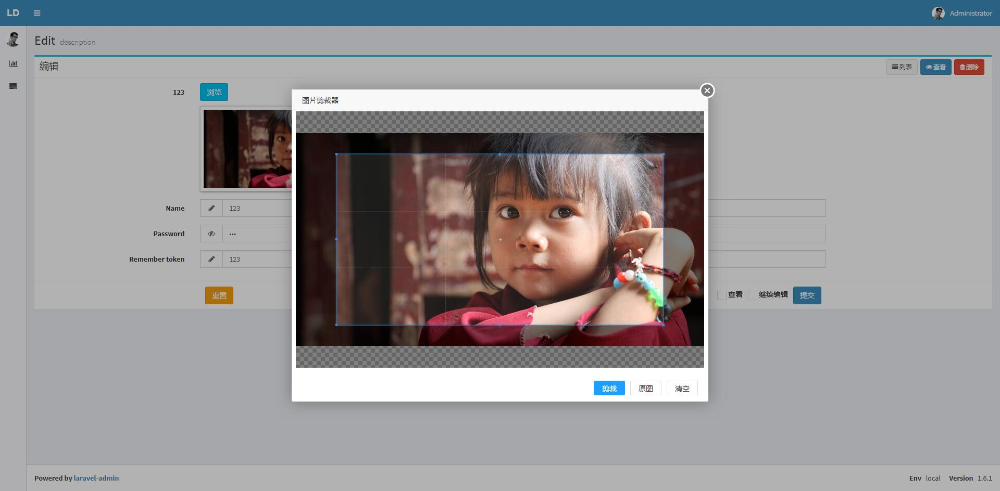

cropper extension for laravel-admin
======

This is a `laravel-admin` extension, used to integrate `cropper` into the `laravel-admin` form

HasMany operation is now supported~, but hasMany memory has image redundancy issues! This seems to be a low-level problem. Of course, it is recommended that you maintain the image status yourself when using hasMany.

## screenshot



## Install

```bash
composer require laravel-admin-ext/cropper
```

Then use the artisan command to publish the resource
```bash
php artisan vendor:publish --provider='Tungnt\Cropper\CropperServiceProvider' --force
```

## Configuration

In the `extensions` of the `config/admin.php` file, add some configurations belonging to this extension
```php

    'extensions' => [

        'cropper' => [
        
            // 如果要关掉这个扩展，设置为false
            'enable' => true,
        ]
    ]
```
At the same time, remember that you must configure the basic disk configuration. Add a `disk` in `config/filesystems.php`:
```
'disks' => [
    ... ,
    // The configuration directory can be defined by yourself
    'admin' => [
        'driver' => 'local',
        'root' => public_path('uploads'),
        'visibility' => 'public',
        'url' => env('APP_URL').'/uploads',
    ],
],
```

## use

Use it in form:
```php
$form->cropper('content','label');
```
The default mode is free crop mode. If you need to force crop size, please use it (note that this size is the final image size, not "proportion")
```php
$form->cropper('content','label')->cRatio($width,$height);
```
## PS （Feature read-ahead）
1、The image is not pre-uploaded, but the front-end converts it to base64 and then fills in the input, and the server then converts it back to save the image.

2、The image format is saved in the original format by default. That is to say, if the original image is a png image with a transparent background, it will still be a png image with a transparent background after saving, and will not be lost (front-end logo artifact)

3、This extension can be called multiple times. It can be adjusted multiple times within the same form without interfering with each other.。

4、Extends the ImageField class and File class that inherits laravel-admin。
So you don’t have to worry about modifying and deleting pictures. They are all operated automatically。
Of course, because it inherits the ImageField class, you can also use various (crop, fit, insert) methods of `intervention/image`
（The premise is that you have`composer require intervention/image`）

5、Now finally supports hasMany! ! ! ! At the same time, various previous logic bugs have been fixed, and localized translation is supported. The translation file is located in `resources\lang\zh-CN\admin_cropper.php` after it is released. It currently supports both Chinese and English languages, and you can choose to add other languages. support。

6、The worse problem is that due to changes in the underlying admin framework, deleting an entry will not automatically delete the picture (I haven’t read the code yet, so it probably has nothing to do with the plug-in itself, because the plug-in code will not be called when deleting an entry, and there is nothing I can do about it) Got it）

7、Future updates will replace the current layer with sweetalert2 provided in the framework to reduce the front-end burden。

License
------------
Licensed under [The MIT License (MIT)](LICENSE).
